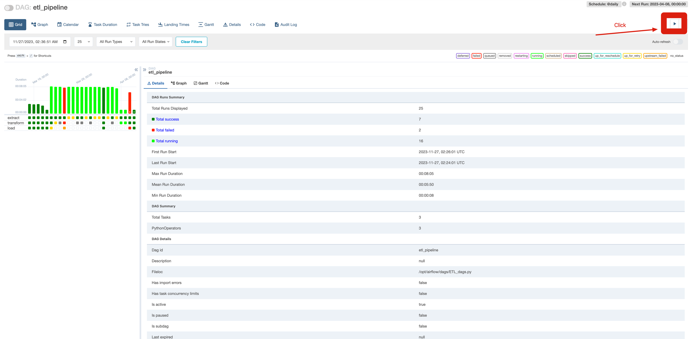
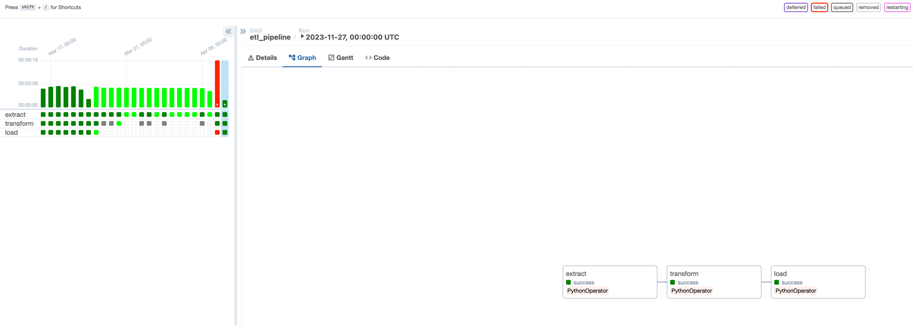
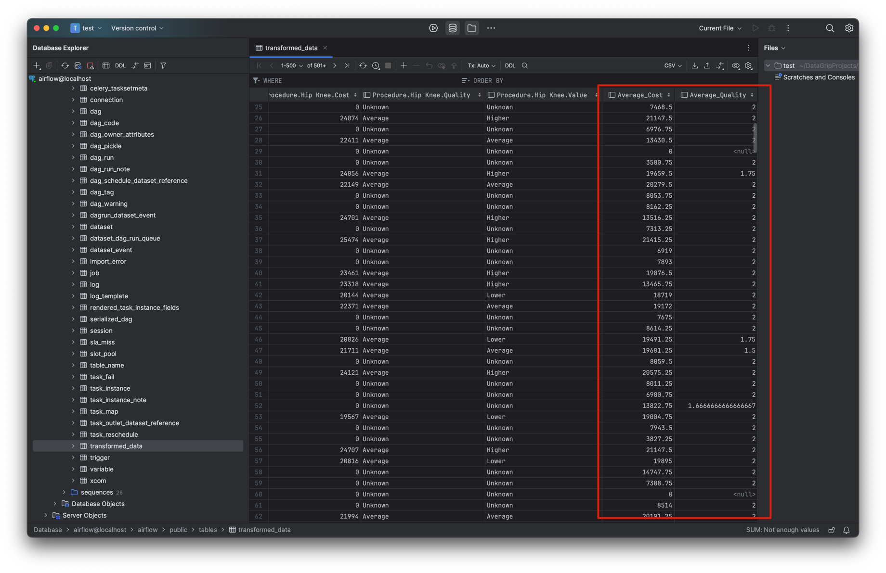

# Airflow-ETL-Example
This is for testing ETL Pipeline with Airflow 
        
# Process
- Extract(CSV file) → Transform(custom) → Load(PostgreSQL)

       
# Quick Start

> For documentation on setting up and running Docker Compose, see [Airflow Docs](https://airflow.apache.org/docs/apache-airflow/stable/howto/docker-compose/index.html).
 
## Run Docker 
```bash
# Make sure to initialize Docker settings based on the above airflow documentation
docker compose up
```

## Run ETL Pipeline


         
<br><br>  

# Result images
                                 
## Success of the pipeline

                          

## Database



# License
- MIT License
- I brought the datalake/hospitals.csv from [here](https://corgis-edu.github.io/corgis/csv/hospitals/) 
